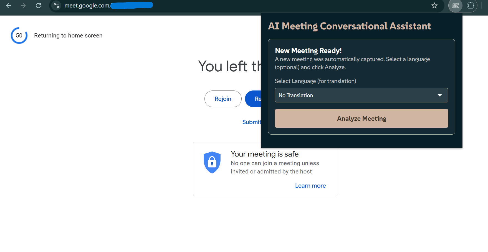
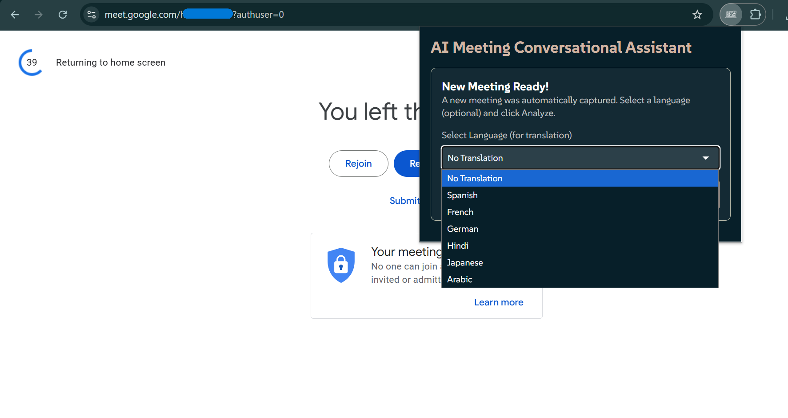
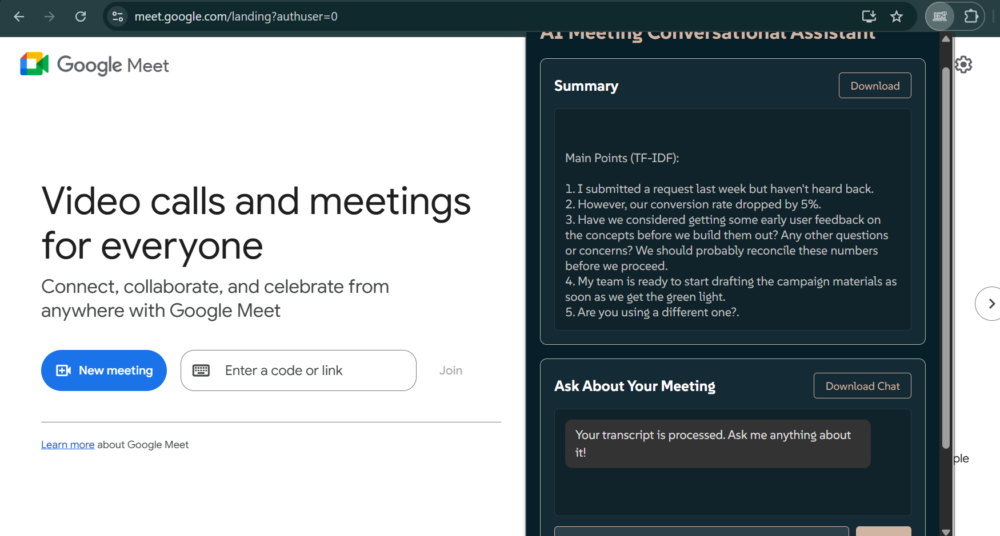
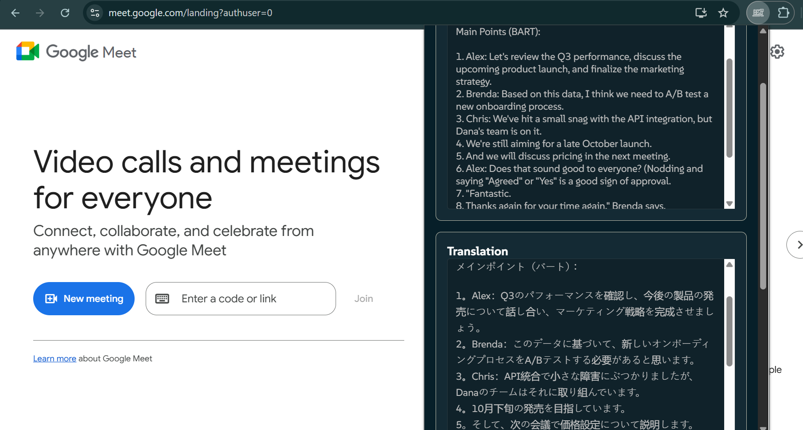
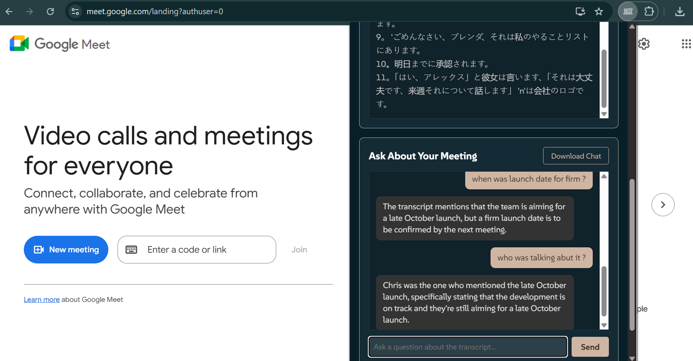

# Meeting Conversational Assistant

Your personal AI assistant to **summarize, translate, and chat with your Google Meet transcripts**.  
Stop losing track of action items and decisions — this tool automatically captures your meeting, processes it, and provides a concise summary plus an interactive conversational AI (RAG) chat.
---

## 📖 Introduction

The **Meeting Conversational Assistant** is a full-stack application that automates the post-meeting workflow.  

It seamlessly integrates with Google Meet to:  
- Capture transcripts + chat.  
- Summarize meetings (extractive/abstractive).  
- Translate summaries.  
- Provide an **interactive RAG-based chatbot**.
- The extension won't lose your work if you accidentally click outside the popup. It saves your progress so you can return to it later.

---

## ✨ Features

- **Automatic Transcript Capture** – Captures the full Google Meet transcript and chat in the background.  
- **Semi-Automated Processing** – Detects when a meeting ends and shows a “New Meeting Ready!” alert.  
- **AI Summarization**  
  - **TF-IDF (active):** Fast, lightweight extractive summarizer.  
  - **BART (optional):** Advanced abstractive summarizer.  
- **On-Demand Translation** – Translate summaries into multiple languages alongside English.  
- **Conversational RAG Q&A** – Ask context-aware questions about your meeting using Groq (Llama 3.1) and a FAISS vector index.  
  - Powered with **conversational memory**, so the chatbot remembers past questions and answers, allowing for coherent multi-turn dialogue. 
- **Persistent Session** – Summaries and chat history are saved locally.  
- **History Page** – Review and download transcripts of your last 10 meetings.  
- **Privacy-First** – Runs locally; API keys and data never leave your machine.

---

## 🖥️ Workflow in Four Simple Steps

### 1️⃣ Automated Capture
When you join a Google Meet, the extension runs silently. At the end, it saves the transcript and chat.

<div align="center">

<p><em>The popup notifies you when a new meeting transcript is ready to be analyzed.</em></p>
</div>

---

### 2️⃣ One-Click Analysis
Open the extension → choose a language → click **Analyze**. The backend processes the transcript and returns a clean summary.

<div align="center">

<p><em>Translation options can also be selected during analysis.</em></p>


<p><em>The backend processes the transcript and returns a clean summary.</em></p>
</div>

---

### 3️⃣ Summary Translation
If you select a language, the backend will provide an on-demand translation of the summary, making it easy to share with a global team.

<div align="center">

<p><em>The translated summary is generated instantly alongside the original summary.</em></p>
</div>

---

### 4️⃣ Conversational AI
The popup becomes an interactive chatbot. Ask questions and get instant, context-aware answers about the meeting content.

<div align="center">

<p><em>Chat with your transcript to find decisions, action items, or discussion points instantly.</em></p>
</div>

---

## 🛠️ Architecture Overview

1. **Capture (`content.js`)** – Extension scrapes the live transcript via a MutationObserver.  
2. **End of Meeting (`background.js`)** – Formats transcript and stores it as `pendingTranscript`.  
3. **User Action (`popup.js`)** – Detects pending transcript → lets user choose language → sends request.  
4. **Backend API (`app.py`)** – Flask server processes the transcript.  
5. **Processing (Python backend)** –  
   - Runs summarization (TF-IDF / BART).  
   - Runs translation (if requested).  
   - Builds a FAISS vector index.  
6. **Chat** – `/ask` endpoint uses LangChain RAG with Groq Llama 3.1 to answer queries.  

---

## 🧑‍💻 Technology Stack

**Frontend (Chrome Extension):**  
- Manifest V3  
- JavaScript (ES6+), HTML5, CSS3  
- `chrome.storage` for state  

**Backend (Python):**  
- Flask  
- LangChain for RAG & chains  
- Groq Llama 3.1 8B Instant (LLM)  
- Google Generative AI embeddings (`models/embedding-001`)  
- FAISS (vector DB)  
- Summarizers:  
  - TF-IDF (NLTK)  
  - BART (`facebook/bart-large-cnn`)  
- deep-translator (translations)  

---

## ⚙️ Setup & Installation

This project has two components: **Backend** and **Chrome Extension**.

### 1️⃣ Backend Setup

```bash
# Clone repo and enter backend folder
git clone <your-repo-url>
cd backend

# Create venv
python -m venv venv

# Activate venv
# Windows
.\venv\Scripts\activate
# macOS/Linux
source venv/bin/activate

# Install dependencies
pip install -r requirements.txt

#Create a .env file inside backend:
GOOGLE_API_KEY=YOUR_GOOGLE_API_KEY_HERE
GROQ_API_KEY=YOUR_GROQ_API_KEY_HERE

#Run server:
python app.py
```
### 2️⃣ Chrome Extension Setup

1. Open Chrome and go to `chrome://extensions`.  
2. Enable **Developer Mode** (toggle in top-right).  
3. Click **Load unpacked**.  
4. Select the `extension/` folder from this repo.  
5. The extension will appear in your toolbar.  

---

## 🚀 Usage

1. Start backend (`python app.py`).  
2. Join a Google Meet call.  
3. When the meeting ends, open the extension popup → **“New Meeting Ready!”** appears.  
4. (Optional) Select a translation language.  
5. Click **Analyze Meeting**.  
6. View:  
   - **Summary**  
   - **Translation (if selected)**  
   - **Chat window** for interactive Q&A  
7. Your data persists — reopen later to continue chat history.  

---

## 🔄 Switching Summarization Models

Default = **TF-IDF**.  
To enable **BART**:  

1. Open `backend/summarizer.py`.  
2. Find `MODEL_TO_USE`.  
3. comment out.  
4. Save file (server restarts automatically).  

